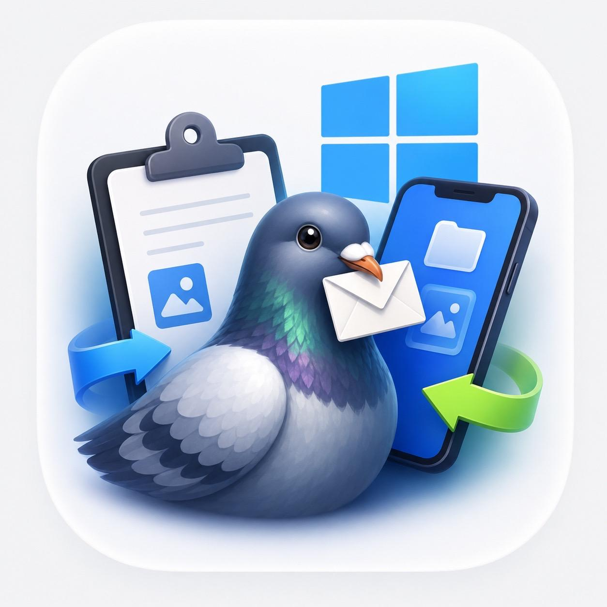

# PigeonPost

<p align="center">
  
</p>

<p align="center">
  <a href="https://holgerimbery.github.io/PigeonPost/">🌐 Website</a> ·
  <a href="https://holgerimbery.github.io/PigeonPost/privacy.html">🔒 Privacy Policy</a> ·
  <a href="https://github.com/holgerimbery/PigeonPost/releases/latest">⬇️ Download</a> ·
  <a href="https://github.com/holgerimbery/PigeonPost/issues">🐛 Support</a>
</p>

PigeonPost is a lightweight Windows 11 tray application that exposes a simple
local HTTP API for transferring files and clipboard content from any network-connected
device to your Windows PC.

Any HTTP-capable client can use it — automation tools like Android Tasker,
command-line utilities like `curl`, scripts, or custom apps.
No cloud service, no account, no setup beyond the app itself.

The [HTTP API is fully documented in the wiki](https://github.com/holgerimbery/PigeonPost/wiki/HTTP-API-Reference) —
making it straightforward to build a native companion app for Android, Linux, macOS,
or any other platform.

**iPhone and iPad users** can get started right away using Apple Shortcuts —
step-by-step setup instructions are in the [iOS Shortcuts wiki page](https://github.com/holgerimbery/PigeonPost/wiki/iOS-Shortcuts).

> **Native iOS companion app — PigeonPostCompanion:**  
> A dedicated iOS companion app is available. It provides a full GUI for
> all PigeonPost functions and includes a **Share Sheet extension**, so you can send
> files and text directly from any app on your iPhone or iPad.  
> The app discovers your PC automatically via **Bonjour/mDNS** — no manual IP entry needed.

<p align="center">
  
</p>

---

## What you get

- **Local HTTP API** on port 2560 — receive files, read and write the clipboard
- **Pigeon + envelope app icon** shown in the title bar, taskbar, and Alt+Tab
- **Mica window** with automatic dark / light theming (Windows 11 Fluent colour palette)
- **Live status indicator** mirrored on the tray icon (green = running, amber = paused)
- **Stat cards**: Files received · Clipboard sends · Clipboard reads · Uptime
- **Collapsible activity log** with colour-coded entries that adapt to the current theme
- **Pause / Resume** — keeps the port open but returns `503` to all incoming requests
- **Open Downloads** button
- **Settings dialog** (⚙️ gear button) — configure the downloads folder, choose Light / Dark / System theme, toggle Start with Windows, enable bearer-token authentication
- **Bearer token authentication** — optional; generate a random token once, copy it to any client, toggle enforcement on/off without restarting the server
- **Help button** (❓) — opens the GitHub repository documentation in your default browser
- **Minimize to tray** — the close button hides the window; left-click the icon to restore
- **Tray context menu**: Show window · Pause / Resume · Quit
- **Start with Windows** — optional autostart toggle; app launches hidden to tray
- **Smart network monitoring** — detects WiFi ↔ LAN switches, IP changes, and offline events; restarts the listener automatically on relevant changes
- **mDNS / Bonjour auto-discovery** — advertises the server as `_pigeonpost._tcp` on the local network so the iOS companion app can find your PC automatically without typing an IP address
- **Auto-update** — checks GitHub Releases on startup and every 24 hours; shows an in-app banner when a new version is available; one click installs and restarts

---

## Authentication

PigeonPost includes optional **bearer token authentication** — disabled by default.
Full details (setup, client usage, curl examples, status codes) are in the
[HTTP API Reference → Authentication](https://github.com/holgerimbery/PigeonPost/wiki/HTTP-API-Reference#authentication) wiki page.

---

## Install

Download the installer for your architecture from the [latest GitHub Release](https://github.com/holgerimbery/PigeonPost/releases/latest) and run it, or install via **Windows Package Manager**:

```
winget install HolgerImbery.PigeonPost
```

To upgrade later:

```
winget upgrade HolgerImbery.PigeonPost
```

| Architecture | Installer |
|---|---|
| **Intel / AMD 64-bit** (most PCs) | `PigeonPost-win-x64-Setup.exe` |
| **ARM 64-bit** (Snapdragon X, Surface Pro X, …) | `PigeonPost-win-arm64-Setup.exe` |

The installer is built by Velopack and handles installation, Start Menu shortcuts, and future auto-updates.
Each architecture has its own update feed (`releases.win-x64.json` / `releases.win-arm64.json`).
Velopack stamps the channel into the installation so the in-app updater always fetches the correct feed automatically — no configuration required.


---

## Documentation

Full documentation is in the [project wiki](https://github.com/holgerimbery/PigeonPost/wiki):

| Page | Description |
|---|---|
| [HTTP API Reference](https://github.com/holgerimbery/PigeonPost/wiki/HTTP-API-Reference) | Clipboard operations, file transfer, bearer authentication, status codes, and curl examples |
| [iOS Shortcuts](https://github.com/holgerimbery/PigeonPost/wiki/iOS-Shortcuts) | Step-by-step Shortcuts setup for iPhone / iPad (English + German) |
| [Remote Access](https://github.com/holgerimbery/PigeonPost/wiki/Remote-Access) | Tailscale setup (Windows 11 + iOS), creating a tailnet, enabling HTTPS |
| [Build from Source](https://github.com/holgerimbery/PigeonPost/wiki/Build-from-Source) | Prerequisites, build & run, Velopack publish, project layout |
| [How It Works](https://github.com/holgerimbery/PigeonPost/wiki/How-It-Works) | HTTP listener binding, bearer auth, mDNS, network change handling, dark / light mode |
| [Troubleshooting](https://github.com/holgerimbery/PigeonPost/wiki/Troubleshooting) | Common issues, fixes, security notes, and 401 errors |

---

## License

Copyright (c) 2026 Holger Imbery

Licensed under the **MIT License** — see the [LICENSE](LICENSE) file for the full text.

