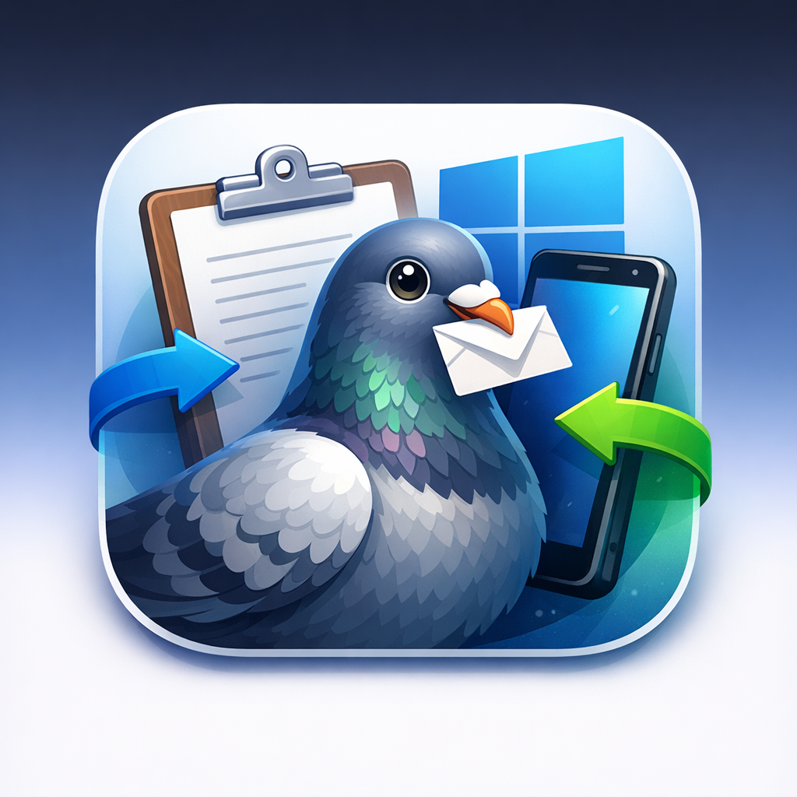
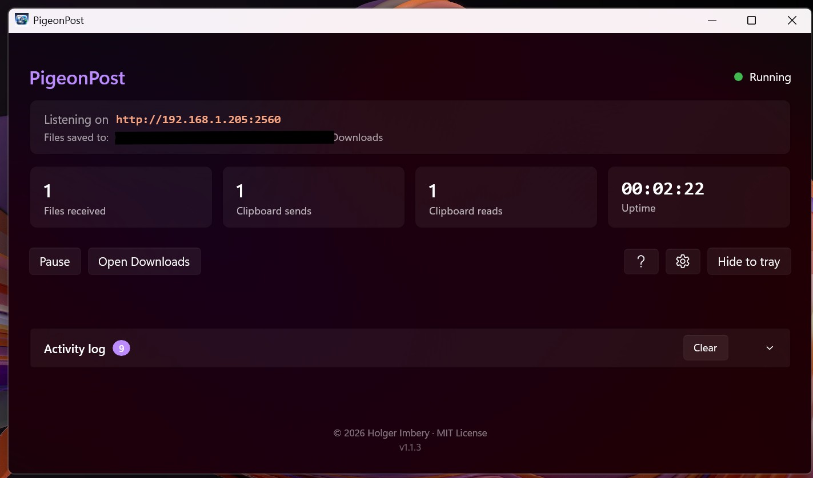

# PigeonPost

  

PigeonPost is a lightweight Windows 11 tray application that exposes a simple
local HTTP API for transferring files and clipboard content from any network-connected
device to your Windows PC.

Any HTTP-capable client can use it — automation tools like Android Tasker,
command-line utilities like `curl`, scripts, or custom apps.
No cloud service, no account, no setup beyond the app itself.

The [HTTP API is fully documented in the wiki](https://github.com/holgerimbery/PigeonPost/wiki/HTTP-API-Reference) —
making it straightforward to build a native companion app for Android, Linux, macOS,
or any other platform.

**iPhone and iPad users** can get started right away using Apple Shortcuts —
step-by-step setup instructions are in the [iOS Shortcuts wiki page](https://github.com/holgerimbery/PigeonPost/wiki/iOS-Shortcuts).

> **Coming soon — native iOS app:**  
> A dedicated iOS companion app is in development. It will provide a full GUI for
> all PigeonPost functions and includes a **Share Sheet extension**, so you can send
> files and text directly from any app on your iPhone or iPad.

  

---

## What you get

- **Local HTTP API** on port 2560 — receive files, read and write the clipboard
- **Pigeon + envelope app icon** shown in the title bar, taskbar, and Alt+Tab
- **Mica window** with automatic dark / light theming (Windows 11 Fluent colour palette)
- **Live status indicator** mirrored on the tray icon (green = running, amber = paused)
- **Stat cards**: Files received · Clipboard sends · Clipboard reads · Uptime
- **Collapsible activity log** with colour-coded entries that adapt to the current theme
- **Pause / Resume** — keeps the port open but returns `503` to all incoming requests
- **Open Downloads** button
- **Settings dialog** (⚙️ gear button) — configure the downloads folder, choose Light / Dark / System theme, toggle Start with Windows
- **Help button** (❓) — opens the GitHub repository documentation in your default browser
- **Minimize to tray** — the close button hides the window; left-click the icon to restore
- **Tray context menu**: Show window · Pause / Resume · Quit
- **Start with Windows** — optional autostart toggle; app launches hidden to tray
- **Smart network monitoring** — detects WiFi ↔ LAN switches, IP changes, and offline events; restarts the listener automatically on relevant changes
- **Auto-update** — checks GitHub Releases on startup and every 24 hours; shows an in-app banner when a new version is available; one click installs and restarts

---

## Install

Download the installer for your architecture from the [latest GitHub Release](https://github.com/holgerimbery/PigeonPost/releases/latest) and run it.

| Architecture | Installer |
|---|---|
| **Intel / AMD 64-bit** (most PCs) | `PigeonPost-win-x64-Setup.exe` |
| **ARM 64-bit** (Snapdragon X, Surface Pro X, …) | `PigeonPost-win-arm64-Setup.exe` |

The installer is built by Velopack and handles installation, Start Menu shortcuts, and future auto-updates.
Each architecture has its own update feed (`releases.win-x64.json` / `releases.win-arm64.json`).
Velopack stamps the channel into the installation so the in-app updater always fetches the correct feed automatically — no configuration required.

---

## Documentation

Full documentation is in the [project wiki](https://github.com/holgerimbery/PigeonPost/wiki):

| Page | Description |
|---|---|
| [HTTP API Reference](https://github.com/holgerimbery/PigeonPost/wiki/HTTP-API-Reference) | Clipboard operations, file transfer, status codes, and curl examples |
| [iOS Shortcuts](https://github.com/holgerimbery/PigeonPost/wiki/iOS-Shortcuts) | Step-by-step Shortcuts setup for iPhone / iPad (English + German) |
| [Remote Access](https://github.com/holgerimbery/PigeonPost/wiki/Remote-Access) | Reach PigeonPost from outside your home network using Tailscale |
| [Build from Source](https://github.com/holgerimbery/PigeonPost/wiki/Build-from-Source) | Prerequisites, build & run, Velopack publish, project layout |
| [How It Works](https://github.com/holgerimbery/PigeonPost/wiki/How-It-Works) | HTTP listener binding, network change handling, dark / light mode |
| [Troubleshooting](https://github.com/holgerimbery/PigeonPost/wiki/Troubleshooting) | Common issues, fixes, and security notes |

---

## License

Copyright (c) 2026 Holger Imbery

Licensed under the **MIT License** — see the [LICENSE](LICENSE) file for the full text.

